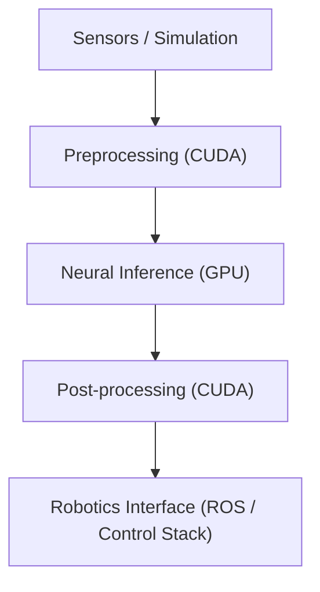
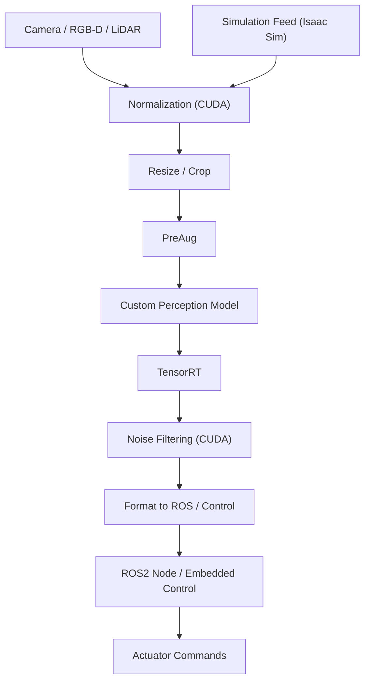

# Motion Aware Perception Model

High-performance GPU-accelerated perception pipeline for autonomous robotic systems, designed for real-time deployment and simulation-to-real workflows.

---

## Overview

This repository implements a custom-trained perception model and inference pipeline optimized with CUDA acceleration for robotics and autonomous systems.  
It supports both simulation environments (e.g., Isaac Sim) and real robotic hardware, enabling end-to-end perception from sensor input to actionable outputs.

**Primary goals:**

- Real-time perception using GPU acceleration  
- Custom model training (no reliance on off-the-shelf perception stacks)  
- Robotics-ready integration (ROS / embedded pipelines)  
- Simulation-to-real transfer support  

---

## System Architecture (High-Level)

---

## Mermaid Diagram of System Architecture

